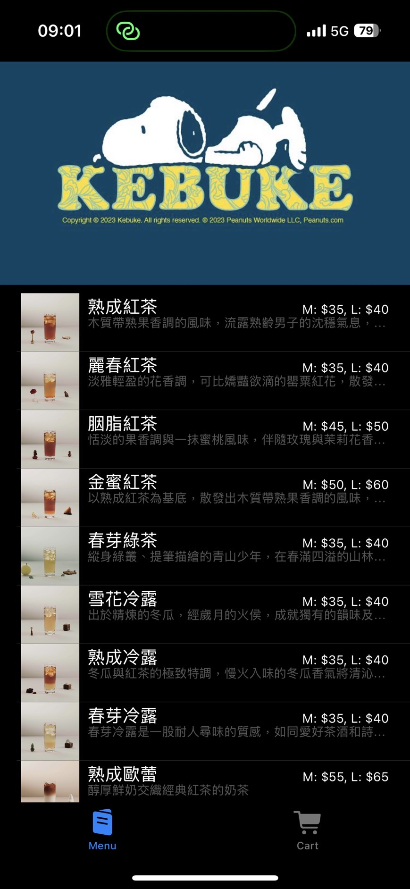
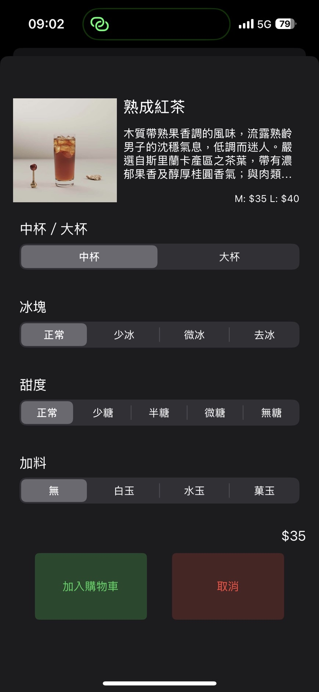

# Kebuke Beverage Shop iOS App

This is an iOS app for a Taiwanese beverage shop called 'Kebuke.' The app allows users to display the menu, adjust ice and sweetness levels, add toppings, and submit orders to Google Sheets.

## Features

- **Display Menu**: Browse through the list of available beverages.
- **Customize Order**: Adjust ice level, sweetness, and add toppings.
- **Add to Cart**: Add customized beverages to the cart.
- **Submit Order**: Send your order to Google Sheets for processing.

## Installation

1. Clone the repository:
    ```sh
    git clone https://github.com/yourusername/kebuke-app.git
    ```
2. Open the project in Xcode.
3. Make sure to set up your Google Sheets API and update the `API_URL` and `CART_API_URL` in the `Info.plist` file.

## Usage

1. **Display Menu**: The Menu tab displays all available beverages. Tap on an item to customize it.
2. **Customize Order**: In the Options screen, select your preferred ice level, sweetness, and toppings. Tap 'Add to Cart' to save your customizations.
3. **View Cart**: Switch to the Cart tab to view all items in your cart. You can swipe left on an item to delete it.
4. **Submit Order**: Your customized order will be sent to Google Sheets when you add it to the cart.

## Screenshots





## Requirements

- iOS 13.0+
- Xcode 12.0+
- Swift 5.0+

## Contributing

1. Fork the repository.
2. Create a new branch.
3. Make your changes.
4. Submit a pull request.

## License

This project is licensed under the MIT License. See the [LICENSE](LICENSE) file for details.

## Acknowledgments

- Inspired by the popular Taiwanese beverage shop 'Kebuke.'
- Thanks to the open-source community for providing the necessary tools and libraries.